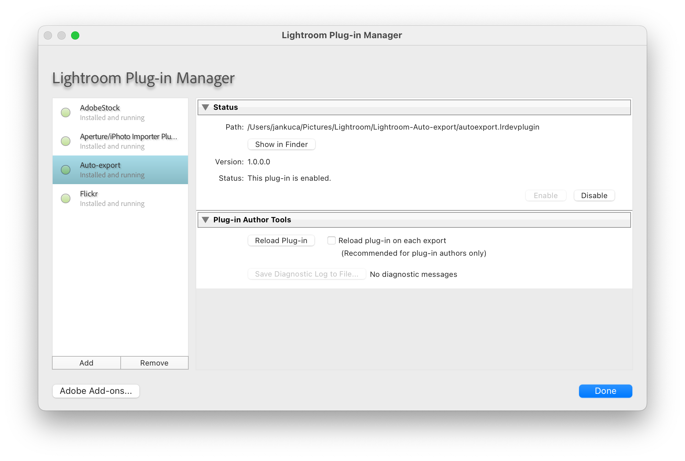
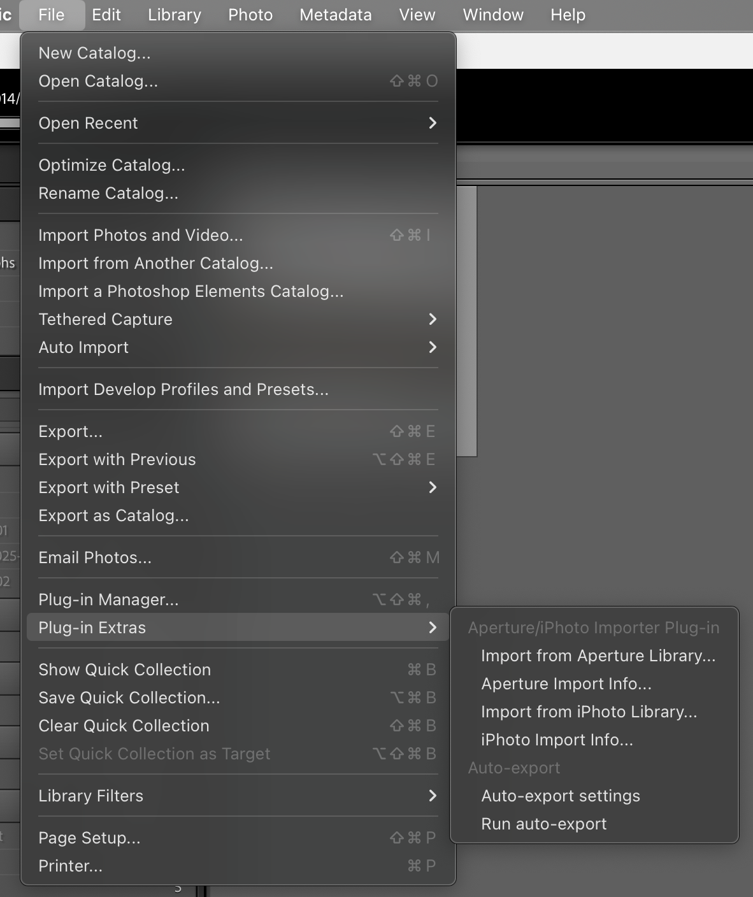

# Auto-export plugin for Adobe Lightroom Classic

Have your complete Lightroom library exported to a certain location automatically in the background

## Installation

1. Clone this repository or download the folder to your disk.

1. Add the plugin by adding the folder in Lightroom via `File > Plug-in Manager` or press `Ctrl+Alt+Shift+,`

   

## Usage

1. Open the "Export" dialog for any photo in your library.

   Note: If you are planning to also be exporting videos, make sure you first select both a photo and a video to have video options available in the Export dialog.

1. Define export options in the dialog and save them as a preset using the left sidebar.

1. Export the newly created export preset (right-click > Export) and close the dialog via "Cancel"

1. Open the settings via "File" > "Plug-in Extras" > "Auto-export settings"

   

1. Set up the auto-export:

    - Choose the export preset you just exported. The export settings should now be listed in the read-only viewer at the bottom.

    - Choose whether you only want to be auto-exporting picked (flagged) items, or also unpicked/unflagged.

      Note: Rejected photos are always skipped.

    - Choose whether auto-exporting should happen automatically after opening Lightroom, or whether you'd like to trigger it manually via the "File" > "Plug-in Extras" > "Run auto-export" menu.

   

## Credits

- This is a heavily reworked fork of [OlafHaalstra/Lightroom-Auto-Import-Export](https://github.com/OlafHaalstra/Lightroom-Auto-Import-Export). Thank you very much for inspiration.
- Thanks to stecman.co.nz archive for [Lightroom SDK documentation](https://archive.stecman.co.nz/files/docs/lightroom-sdk/API-Reference/).
